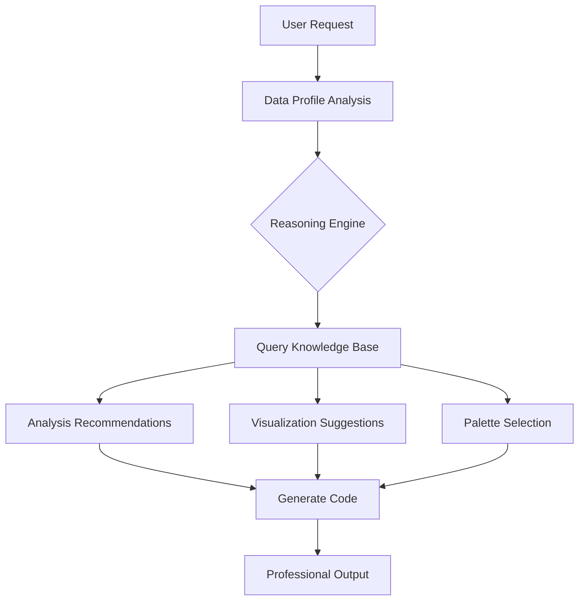

# Data Pro Max - Data Analysis Intelligence

An AI skill that provides **intelligent recommendations** for data analysis, visualization, and reporting. Like UI UX Pro Max for design, this skill automatically activates for data work and provides context-aware guidance.

## When This Skill Activates

This skill auto-activates when you request:
- Analyze data, run statistics, create visualizations
- Build reports, dashboards, or presentations
- Clean, transform, or model datasets
- Survey analysis, market research, or customer insights

## Quick Start

Just ask naturally:
```
Analyze this survey data and create a professional report
Create a correlation analysis with visualizations
What statistical test should I use for comparing 3 groups?
```

## Knowledge Base

| Component | Count | Description |
|-----------|-------|-------------|
| Analysis Types | 30+ | Descriptive, inferential, modeling, NLP, time series |
| Visualization Rules | 35+ | Chart recommendations with when-to-use guidance |
| Color Palettes | 22 | Domain-specific palettes (survey, healthcare, finance) |
| Reasoning Rules | 40+ | Automatic recommendations based on data characteristics |

## How It Works



### Step 1: Analyze Data Profile
The skill profiles your data to understand:
- **Data Types**: Numeric, categorical, text, datetime
- **Distributions**: Skewness, normality, outliers
- **Structure**: Sample size, missing values, grouping variables

### Step 2: Query Knowledge Base (REQUIRED)
Use the search tool to find approved patterns:

```bash
# Search for analysis types
python3 .agent/skills/data-pro-max/scripts/search.py "correlation analysis"

# Search for visualizations
python3 .agent/skills/data-pro-max/scripts/search.py --type visualization "bar chart"

# Search for palettes by domain
python3 .agent/skills/data-pro-max/scripts/search.py --type palette --domain survey

# Search for reasoning rules
python3 .agent/skills/data-pro-max/scripts/search.py --type rule "missing data"

# Filter by domain and category
python3 .agent/skills/data-pro-max/scripts/search.py --domain survey --category inferential
```

### Step 3: Apply Recommendations
Implement analysis following the retrieved patterns with proper:
- Statistical assumptions checking
- Appropriate test selection
- Effect size reporting
- Professional visualization styling

## Domains Covered

| Domain | Focus Areas |
|--------|-------------|
| `survey` | NPS, satisfaction, Likert scales, cross-tabs, weighting |
| `research` | Hypothesis testing, experimental design, academic reporting |
| `marketing` | Segmentation, personas, funnel analysis, TURF |
| `healthcare` | Survival analysis, clinical trials, patient outcomes |
| `financial` | Time series, forecasting, risk analysis |
| `general` | Universal patterns applicable across domains |

## Integration with Other Skills

Data Pro Max integrates with:
- **survey-stats**: Advanced weighting, factor analysis, clustering
- **report-writer**: Professional PDF/DOCX generation
- **mermaid-diagrams**: Flowcharts, ERDs, architecture diagrams
- **documentation-mastery**: Rich Markdown with GitHub alerts

## Example Workflow

```python
# 1. Load and profile data
import pandas as pd
df = pd.read_csv("survey_data.csv")
print(df.info())
print(df.describe())

# 2. Check reasoning rules for recommendations
# (Run: python3 search.py --type rule "survey")

# 3. Apply recommended analysis
from scipy import stats
# Check normality before parametric tests
stat, p = stats.shapiro(df['satisfaction'])
if p < 0.05:
    # Use non-parametric (per rule r005)
    result = stats.mannwhitneyu(group1, group2)
else:
    result = stats.ttest_ind(group1, group2)

# 4. Visualize with recommended palette
# (Run: python3 search.py --type palette --domain survey)
import seaborn as sns
sns.set_palette("RdYlGn")  # warm_survey palette
```

## Pre-Delivery Checklist

Before delivering analysis:
- [ ] Statistical assumptions verified
- [ ] Effect sizes reported (not just p-values)
- [ ] Visualizations use appropriate chart types
- [ ] Color palette matches domain/audience
- [ ] Missing data handled explicitly
- [ ] Reproducibility ensured (random seeds, versions)
- [ ] Report structure matches audience (executive vs technical)

## File Structure

```
.agent/skills/data-pro-max/
├── SKILL.md                    # This file
├── data/
│   ├── analysis_types.csv      # 30+ analysis methods
│   ├── visualization_rules.csv # 35+ chart recommendations
│   ├── palettes.csv            # 22 domain palettes
│   ├── reasoning_rules.csv     # 40+ auto-recommendations
│   └── framework.md            # Detailed implementation guide
└── scripts/
    └── search.py               # CLI search tool
```
