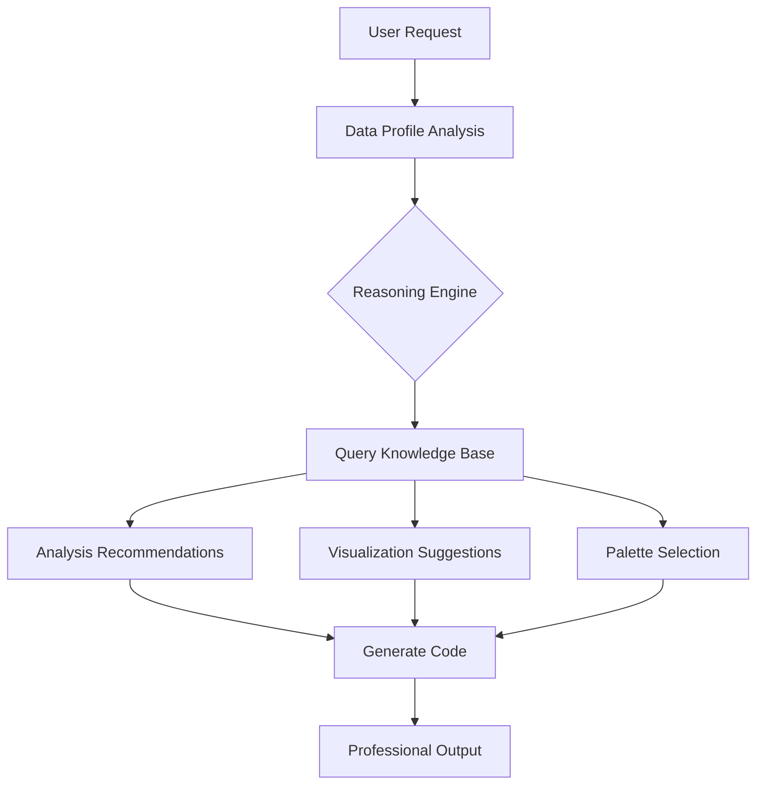
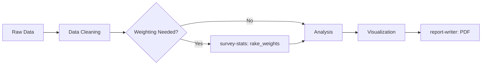

# Data Pro Max - Data Analysis Intelligence

An AI skill that provides **intelligent recommendations** for data analysis, visualization, and reporting. Like UI UX Pro Max for design, this skill automatically activates for data work and provides context-aware guidance.

## When This Skill Activates

This skill auto-activates when you request:
- Analyze data, run statistics, create visualizations
- Build reports, dashboards, or presentations
- Clean, transform, or model datasets
- Survey analysis, market research, or customer insights

## Quick Start

Just ask naturally:
```
Analyze this survey data and create a professional report
Create a correlation analysis with visualizations
What statistical test should I use for comparing 3 groups?
```

## Knowledge Base

| Component | Count | Description |
|-----------|-------|-------------|
| Analysis Types | 65+ | Descriptive, inferential, modeling, NLP, time series, survey-stats |
| Visualization Rules | 63+ | Chart recommendations with when-to-use guidance |
| Visualization Styles | 20 | Pre-configured matplotlib/seaborn styles for different contexts |
| Color Palettes | 42 | Domain-specific palettes (survey, healthcare, finance, accessibility) |
| Reasoning Rules | 80+ | Automatic recommendations based on data characteristics |


## How It Works



### Step 1: Analyze Data Profile
The skill profiles your data to understand:
- **Data Types**: Numeric, categorical, text, datetime
- **Distributions**: Skewness, normality, outliers
- **Structure**: Sample size, missing values, grouping variables

### Step 2: Query Knowledge Base (REQUIRED)
Use the unified `datapro` CLI to find approved patterns:

```bash
# Search knowledge base
datapro search "correlation analysis"
datapro search --type visualization "bar chart"
datapro search --type palette --domain survey

# Analyze a dataset and get recommendations
datapro analyze data.csv --domain survey --goal "segmentation"

# Generate PDF report from markdown
datapro report analysis.md -o report.pdf --title "Survey Results"

# List visualization styles
datapro style --list

# Full pipeline: analyze → report
datapro pipeline data.csv -o report.pdf --domain survey
```

### Step 3: Apply Recommendations
Implement analysis following the retrieved patterns with proper:
- Statistical assumptions checking
- Appropriate test selection
- Effect size reporting
- Professional visualization styling

## Domains Covered

| Domain | Focus Areas |
|--------|-------------|
| `survey` | NPS, satisfaction, Likert scales, cross-tabs, weighting |
| `research` | Hypothesis testing, experimental design, academic reporting |
| `marketing` | Segmentation, personas, funnel analysis, TURF |
| `healthcare` | Survival analysis, clinical trials, patient outcomes |
| `financial` | Time series, forecasting, risk analysis |
| `general` | Universal patterns applicable across domains |

## Integrated Skills

Data Pro Max orchestrates these specialized skills for end-to-end analysis:

### survey-stats (Statistical Analysis)
Advanced multivariate analysis for survey data.

```python
# Sample Weighting (Raking)
from scripts.weighting import rake_weights
targets = {'gender': {'Male': 0.49, 'Female': 0.51}}
df['weight'] = rake_weights(df, targets)

# Factor Analysis
from scripts.factor_analysis import run_factor_analysis
cols = ['q1_sat', 'q2_sat', 'q3_sat']
loadings, variance = run_factor_analysis(df, cols)

# Clustering / Personas
from scripts.clustering import run_segmentation
df = run_segmentation(df, ['factor1', 'factor2'], n_clusters=4)

# TURF Analysis
from scripts.turf_analysis import run_turf_analysis
results = run_turf_analysis(df, product_columns)
```

### document-converter (PDF/DOCX Output)
Professional report generation from Markdown.

```bash
# Generate PDF with cover page
python3 .agent/skills/document-converter/scripts/compile_report.py \
    report.md \
    --format pdf \
    --title "Survey Analysis Report" \
    --subtitle "Q1 2026" \
    --color "2980b9"

# Generate DOCX for editing
python3 .agent/skills/document-converter/scripts/compile_report.py \
    report.md --format docx
```


### mermaid-diagrams (Visual Documentation)
Syntax-correct diagrams for documentation.



**Best Practice**: Wrap labels with special chars in quotes: `id["Label (Info)"]`

### dictionary-mapper (Variable Mapping)
Automates mapping of raw variable names (P1, Q3) to semantic labels.

```bash
# Infer mapping from CSV headers (SurveyMonkey/Google Forms style)
python3 .agent/skills/data-pro-max/scripts/dictionary_mapper.py \
    raw_data.csv \
    -o mapping.json

# Then use mapping in analysis
import json
with open('mapping.json') as f:
    var_map = json.load(f)
df.rename(columns={v['original_name']: v['label'] for v in var_map.values()})
```


## Example Workflow

```python
# 1. Load and profile data
import pandas as pd
df = pd.read_csv("survey_data.csv")
print(df.info())
print(df.describe())

# 2. Check reasoning rules for recommendations
# (Run: python3 search.py --type rule "survey")

# 3. Apply recommended analysis
from scipy import stats
# Check normality before parametric tests
stat, p = stats.shapiro(df['satisfaction'])
if p < 0.05:
    # Use non-parametric (per rule r005)
    result = stats.mannwhitneyu(group1, group2)
else:
    result = stats.ttest_ind(group1, group2)

# 4. Visualize with recommended palette
# (Run: python3 search.py --type palette --domain survey)
import seaborn as sns
sns.set_palette("RdYlGn")  # warm_survey palette
```

## Pre-Delivery Checklist

Before delivering analysis:
- [ ] Statistical assumptions verified
- [ ] Effect sizes reported (not just p-values)
- [ ] Visualizations use appropriate chart types
- [ ] Color palette matches domain/audience
- [ ] Missing data handled explicitly
- [ ] Reproducibility ensured (random seeds, versions)
- [ ] Report structure matches audience (executive vs technical)

## File Structure

```
.agent/skills/data-pro-max/
├── SKILL.md                    # This file
├── data/
│   ├── analysis_types.csv      # 65+ analysis methods
│   ├── visualization_rules.csv # 63+ chart recommendations
│   ├── palettes.csv            # 42 domain palettes
│   ├── reasoning_rules.csv     # 80+ auto-recommendations
│   └── framework.md            # Detailed implementation guide
└── scripts/
    ├── search.py               # CLI search tool
    ├── reasoning_engine.py     # Auto-recommendation system
    └── dictionary_mapper.py    # Variable name → label mapping

Related Skills:
├── survey-stats/               # Weighting, FA, PCA, Clustering, TURF
├── document-converter/         # PDF/DOCX import/export
└── mermaid-diagrams/           # Visual documentation
```

