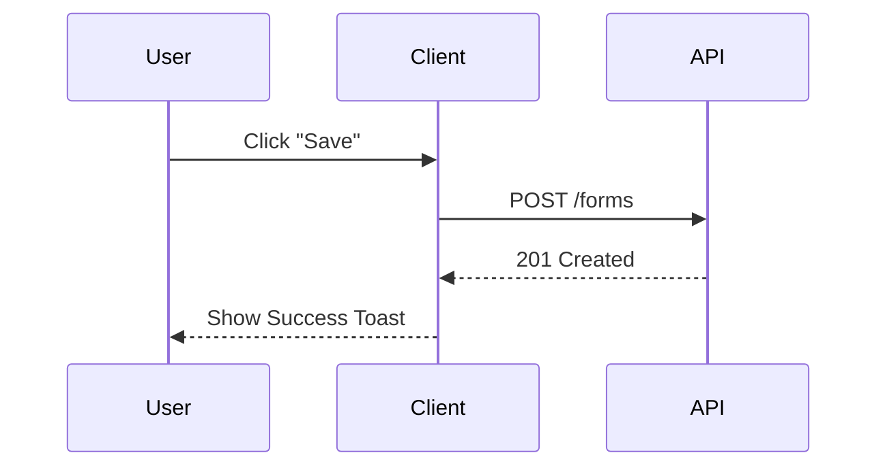
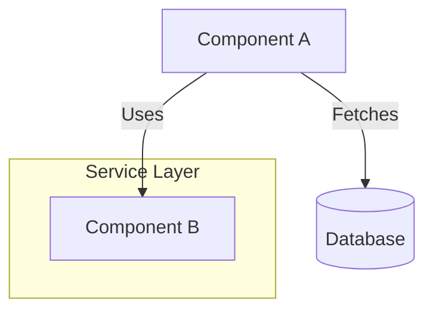
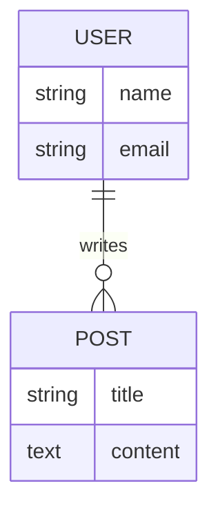

# Documentation Mastery

Use esta skill quando precisar criar ou editar arquivos em `.agent/references/` ou `.agent/memory/`. O objetivo é manter um padrão visual alto e consistência técnica.

## 1. Markdown Patterns

### Alerts (GitHub Style)
Use para destacar informações críticas.
```markdown
> [!NOTE]
> Use para contexto adicional ou dicas neutras.

> [!IMPORTANT]
> Use para requisitos obrigatórios ou passos cruciais.

> [!WARNING]
> Use para Breaking Changes ou advertências de segurança.
```

### Code Blocks
Sempre especifique a linguagem e, se possível, o arquivo de origem.
\`\`\`typescript:client/src/types.ts
interface User {
  id: string;
}
\`\`\`

### Links Relativos
Sempre use links relativos para navegar entre docs.
- ✅ `[Architecture](./architecture.md)`
- ❌ `[Architecture](/docs/architecture.md)`

## 2. Mermaid Patterns

### Sequence Diagram (Fluxos)
Para documentar interações API/Client.


### Graph (Arquitetura/Estrutura)
Para explicar relações entre componentes.


### ER Diagram (Banco de Dados)
Para documentar schema.


## 3. Estrutura de Documentos

Todo documento técnico deve seguir este esqueleto:

```markdown
# [Título Claro]

## Visão Geral
Uma frase explicando O QUE é e PARA QUE serve.

## Diagrama (Opcional, mas recomendado)
Mermaid chart ilustrando o conceito.

## API / Interface / Schema
Tabelas ou blocos de código detalhando os dados.

## Fluxo de Uso
Como isso é usado na prática?

## Nota de Manutenção
> [!NOTE]
> Última atualização: YYYY-MM-DD
```
