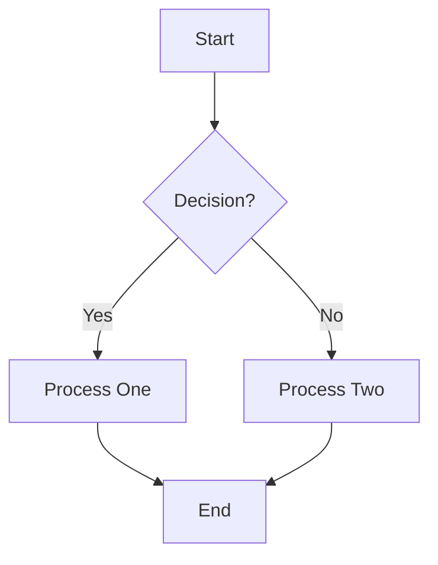
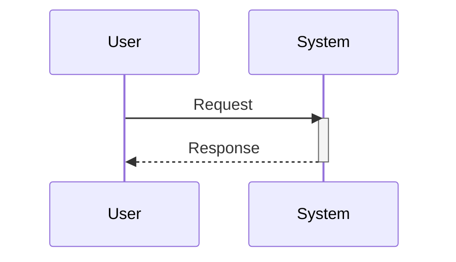
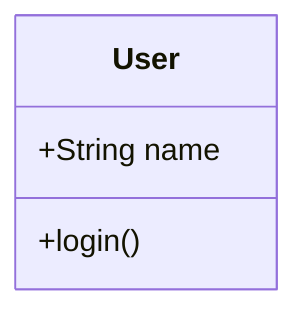

# Mermaid Diagrams

This skill provides guidelines and patterns for creating syntax-correct and visually effective MermaidJS diagrams.

## Best Practices (Critical)

1.  **Escape Special Characters**: Labels with special characters (parentheses `()`, brackets `[]`, braces `{}`) MUST be wrapped in double quotes.
    *   ❌ `id[Process (Draft)]` -> Syntax Error
    *   ✅ `id["Process (Draft)"]`
2.  **Avoid HTML**: Do not use HTML tags inside node labels if possible.
3.  **Direction**: Use `TD` (Top-Down) or `LR` (Left-Right) primarily.
4.  **Subgraphs**: Use subgraphs to group related nodes visually.
5.  **Styling**: Keep styling minimal. Use classes if necessary.

## Common Diagram Types

### Flowchart
Used for workflows, decision trees, and process maps.

### Sequence Diagram
Used for interactions between systems or actors over time.

### Class Diagram
Used for data models and OOP structures.

## Advanced References
See [references/examples.md](references/examples.md) for complex patterns like:
- State Diagrams
- Gantt Charts
- Entity Relationship Diagrams (ERD)
- User Journey Maps
