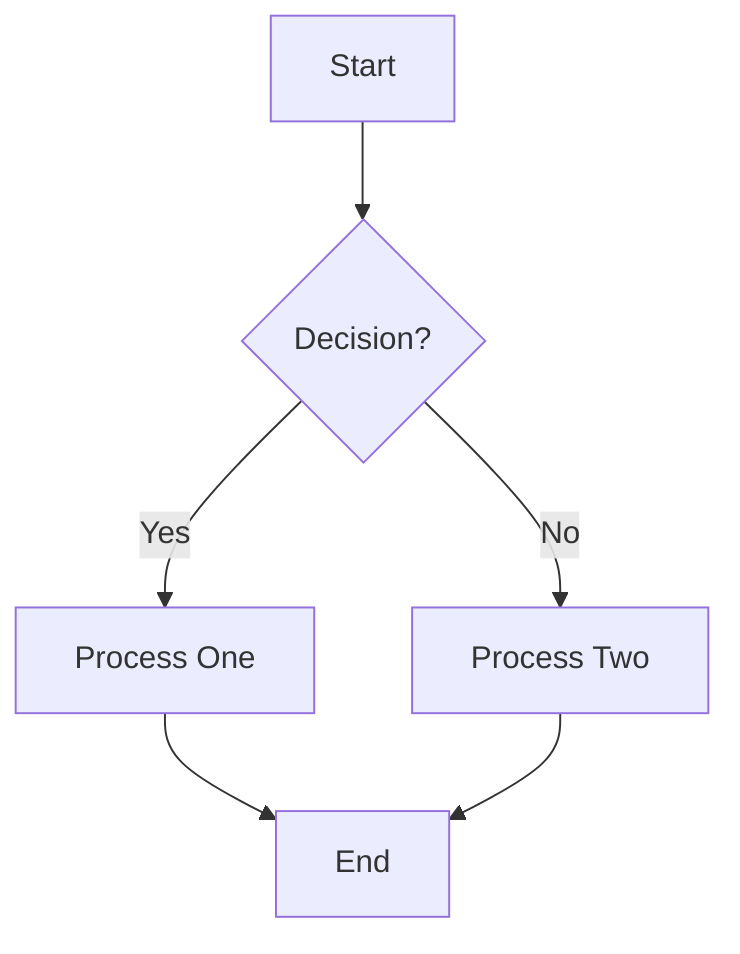
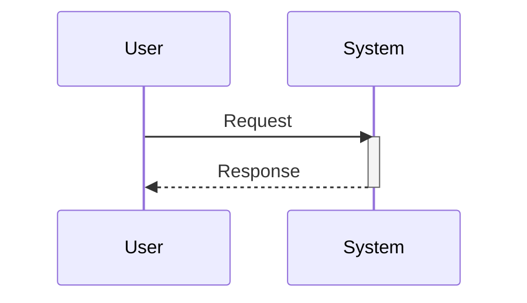
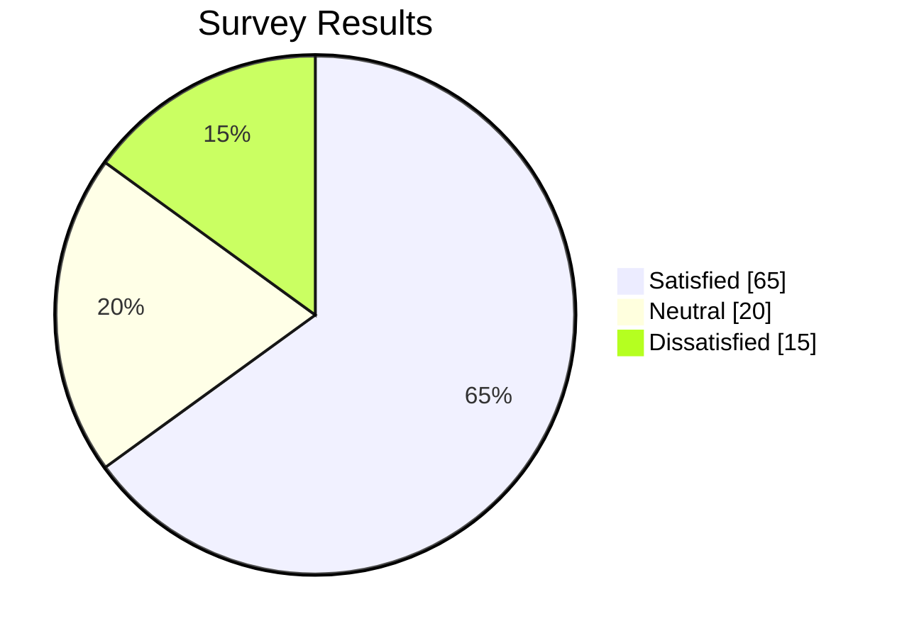
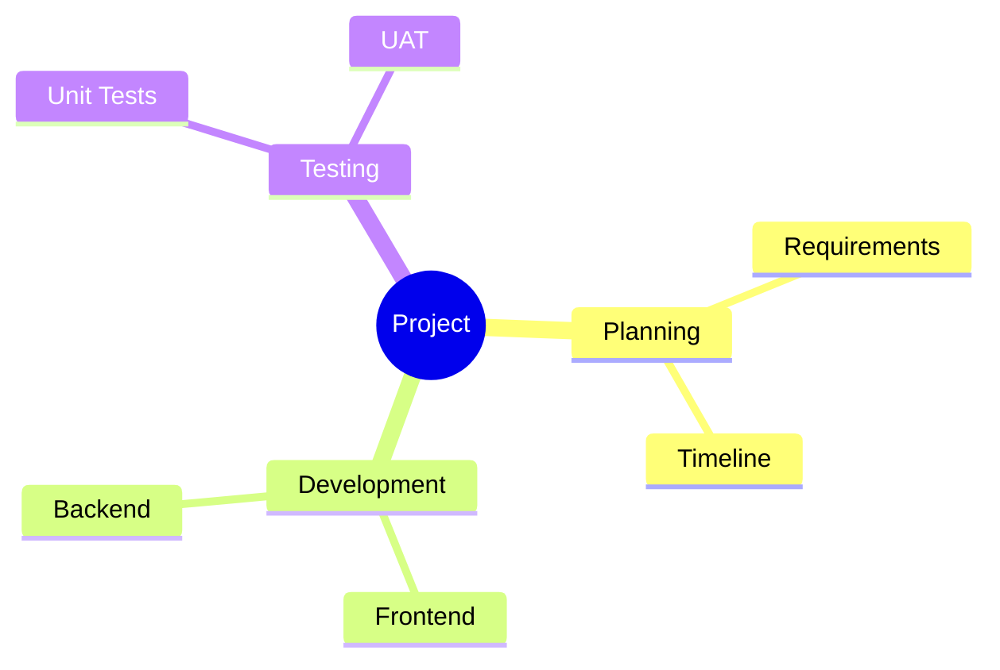
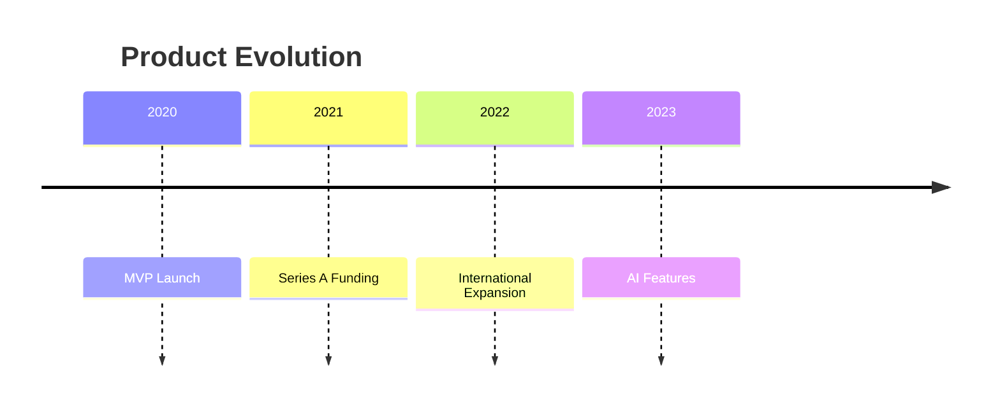
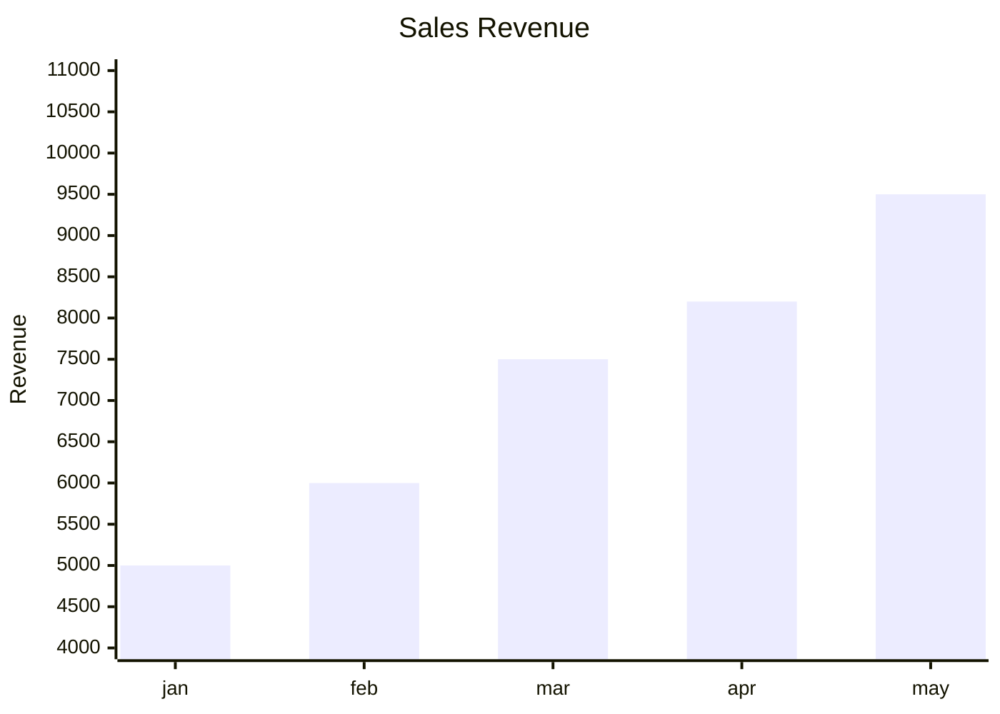
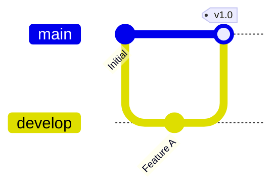
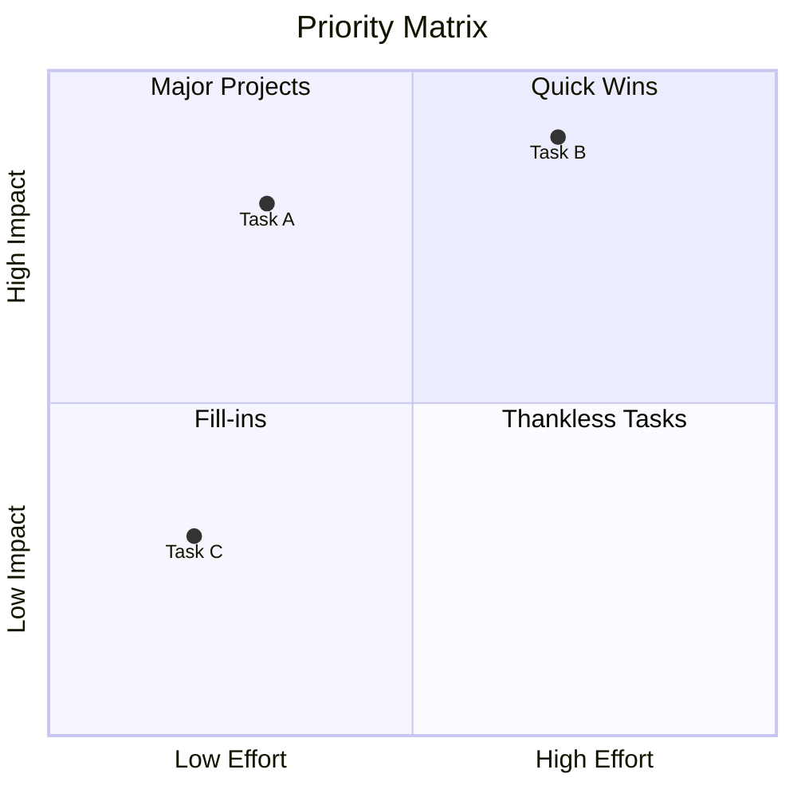

# Mermaid Diagrams

This skill provides guidelines and patterns for creating syntax-correct and visually effective MermaidJS diagrams.

## Supported Diagram Types

| Category | Diagram Type | Use Case |
|----------|-------------|----------|
| **Flow** | Flowchart | Workflows, decision trees, process maps |
| **Flow** | State Diagram | Finite state machines, lifecycles |
| **Flow** | Block Diagram | System layouts, component structures |
| **Sequence** | Sequence Diagram | API calls, system interactions |
| **Sequence** | ZenUML | Alternative sequence syntax, more readable |
| **Structure** | Class Diagram | OOP models, data structures |
| **Structure** | ERD | Database schemas, relationships |
| **Architecture** | C4 Context | Software architecture (C4 model) |
| **Architecture** | Architecture | Cloud/system diagrams (v11.1+) |
| **Data** | Pie Chart | Proportions, distributions |
| **Data** | Quadrant Chart | Strategic analysis, BCG matrix |
| **Data** | XY Chart | Bar/line charts with data |
| **Data** | Sankey | Flow visualization, resource distribution |
| **Planning** | Gantt Chart | Project timelines, schedules |
| **Planning** | Timeline | Historical events, milestones |
| **Planning** | Kanban | Agile boards (v11.4+) |
| **Concept** | Mindmap | Brainstorming, hierarchical ideas |
| **Concept** | User Journey | UX mapping, customer experience |
| **Tech** | Gitgraph | Git branches, version control |
| **Tech** | Packet Diagram | Network protocols, data structures |
| **Tech** | Requirement | Systems engineering, traceability |

## Best Practices (Critical)

1.  **Escape Special Characters**: Labels with special characters (parentheses `()`, brackets `[]`, braces `{}`) MUST be wrapped in double quotes.
    *   ❌ `id[Process (Draft)]` -> Syntax Error
    *   ✅ `id["Process (Draft)"]`
2.  **Avoid HTML**: Do not use HTML tags inside node labels if possible.
3.  **Direction**: Use `TD` (Top-Down) or `LR` (Left-Right) primarily.
4.  **Subgraphs**: Use subgraphs to group related nodes visually.
5.  **Styling**: Keep styling minimal. Use classes if necessary.
6.  **Beta Features**: Use `-beta` suffix for experimental diagrams (e.g., `sankey-beta`, `xychart-beta`).

## Quick Examples

### Flowchart

### Sequence Diagram

### Pie Chart

### Mindmap

### Timeline

### XY Chart (Data)

### Gitgraph

### Quadrant Chart

## Advanced References

See [references/examples.md](references/examples.md) for complete examples of all 18 diagram types including:

- State Diagrams, Gantt Charts, ERD, User Journey
- Sankey, Block Diagram, Architecture Diagram
- Packet Diagram, Kanban, Requirement Diagram
- C4 Context, ZenUML Sequence

## Version Compatibility

| Diagram | Minimum Version |
|---------|-----------------|
| Flowchart, Sequence, Class, State, ERD, Gantt | v8.0+ |
| Pie Chart, User Journey | v9.0+ |
| Mindmap, Timeline | v9.4+ |
| Quadrant Chart, XY Chart | v10.0+ |
| Gitgraph, Sankey | v10.0+ (beta) |
| Block Diagram | v10.9+ |
| Architecture | v11.1+ |
| Packet Diagram | v11.0+ |
| Kanban | v11.4+ |
