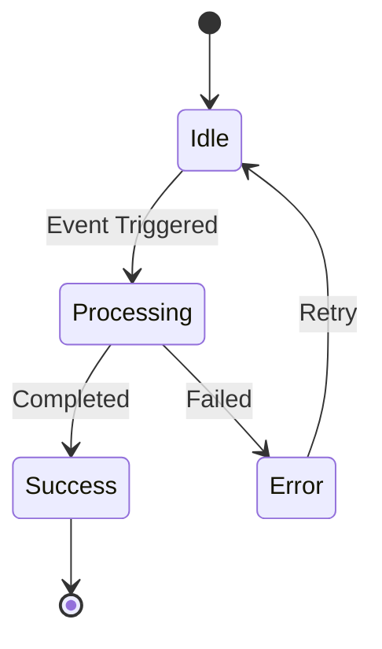
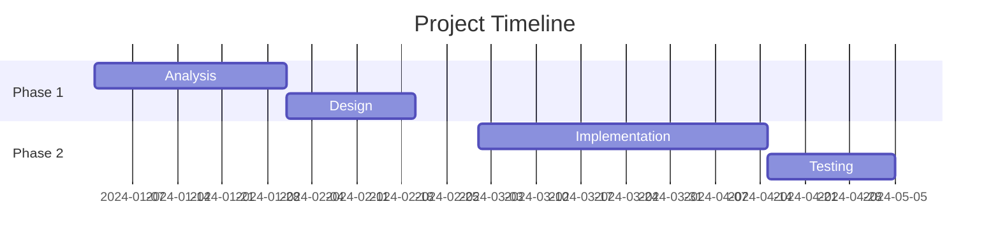
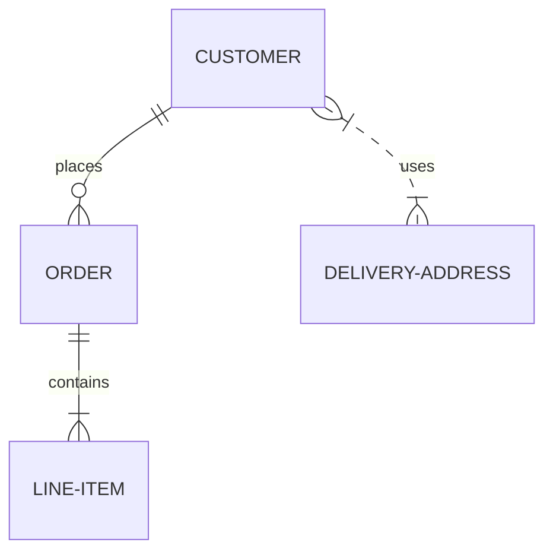
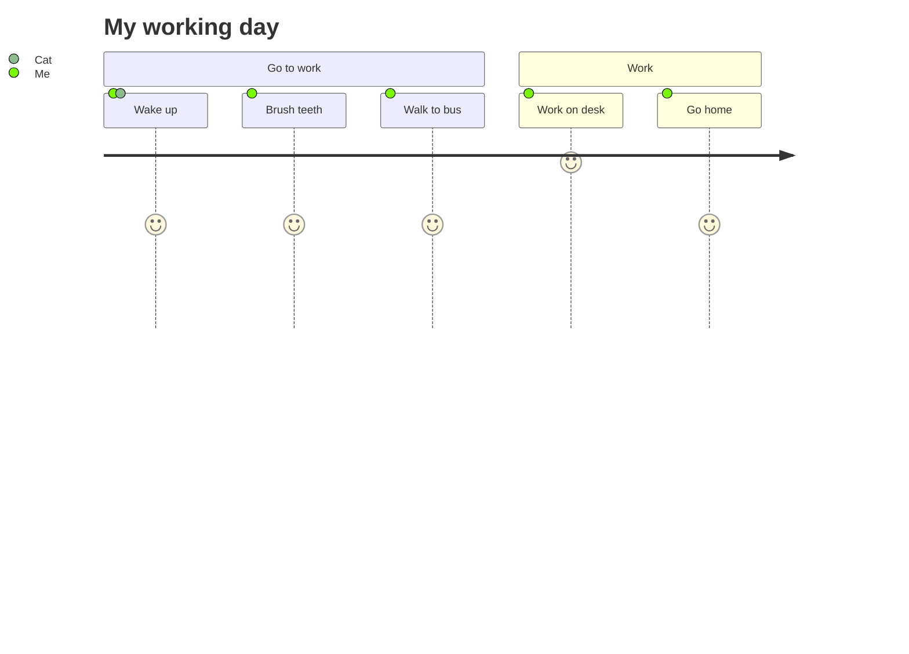

# Mermaid Examples Reference

## State Diagram
Useful for finite state machines.

## Gantt Chart
Useful for project timelines.

## Entity Relationship Diagram (ERD)
Useful for database schemas.

## User Journey
Useful for product design.

