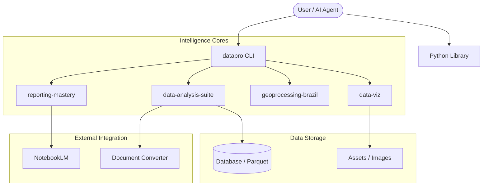

<div align="center">
  
  <h1>Data Pro Max</h1>
  <p><b>The Ultimate AI-Powered Intelligence Suite for Data Science & Surveys</b></p>
  
  <p>
    
    
    
    
  </p>
</div>

---

## 🌟 Overview

**Data Pro** is a high-performance intelligence layer designed to transform raw data into professional insight. It combines a powerful Python CLI, a versatile library, and specialized **AI Agent Skills** to automate the most complex parts of the data science lifecycle.

> [!TIP]
> This repository is the "Data Science counterpart" to the acclaimed [UI UX Pro Max](https://github.com/nextlevelbuilder/ui-ux-pro-max-skill).

---

## 🏗️ Architecture



---

## ⚡ Key Features

| Feature | Description | Tooling |
| :--- | :--- | :--- |
| **Survey Intelligence** | Weighting (Raking), Drivers, and Halo Removal. | `data-analysis-suite` |
| **Advanced Visuals** | Evolution plots, heatmaps, and word clouds. | `data-viz` |
| **Geo-Spatial** | Brazilian city normalization and choropleth maps. | `geoprocessing-brazil` |
| **Professional Reports** | Styled PDFs with Mermaid support and watermarks. | `reporting-mastery` |
| **Auto-Mapping** | Variable standardization and dictionary mapping. | `datapro setup` |

---

## 📦 Installation

```bash
# Clone and Install
git clone https://github.com/pablodiegoo/Data-Pro-Skill
cd Data-Pro-Skill
pip install -e .

# Full Feature Suite (OCR, Stats, Advanced PDF)
pip install "datapro[full,docs] @ git+https://github.com/pablodiegoo/Data-Pro-Skill"
```

> [!IMPORTANT]
> For the **Advanced PDF Engine**, system dependencies are required:
> `sudo apt install pandoc texlive-xetex texlive-fonts-extra`

---

## 🚀 Quick Start

### 1. Project Initialization
```bash
datapro setup
```
Initializes the [Source of Truth](.agent/references/structure.json) and prepares the agent environment.

### 2. High-Speed Analysis
```bash
datapro analyze data.csv --goal "nps drivers"
```

### 3. Premium Reporting
```bash
datapro report results.md --theme executive --logo ./logo.png
```

---

## 📂 Project Structure

Following the **Unified Structure Reference** ([structure.json](.agent/references/structure.json)):

- `scripts/`: Implementation scripts (utils, notebooks).
- `database/`: Raw, processed, and final datasets.
- `docs/`: Studies, reports, and retrospectives.
- `assets/`: Images, final docs, and project context.
- `.agent/`: AI Agent "Brain" (Rules, Skills, Workflows).

---

## 🤝 Contributing

We follow a strict **English-only policy** for code and documentation. Please refer to [CONTRIBUTING.md](CONTRIBUTING.md) before submitting pull requests.

## ⚖️ License

Distributed under the **MIT License**. See `LICENSE` for more information.

---
<div align="center">
  Built with ❤️ for the Data Science Community
</div>
