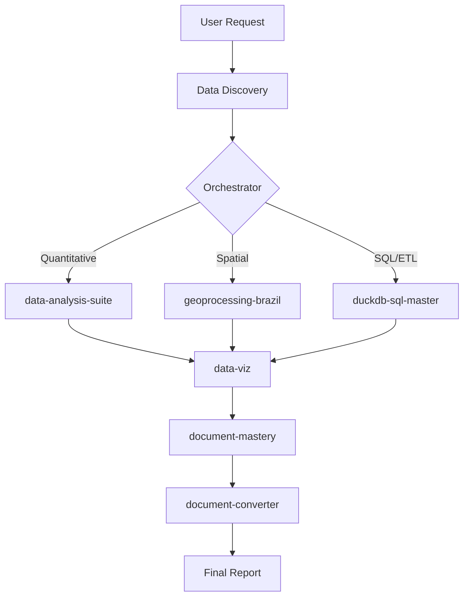

# Data Pro Max - Data Analysis Intelligence

An AI orchestrator that provides **intelligent recommendations** for data analysis, visualization, and reporting. It automatically activates for data-intensive tasks and coordinates specialized sub-skills.

## 1. Integrated Skill Cores

Data Pro Max coordinates these specialized consolidated skills:

| Core Skill | Functionality | Primary Trigger |
| :--- | :--- | :--- |
| **`data-analysis-suite`** | All Stats, Causal & Science | Survey weighting, drivers, halo effects, pipeline automation. |
| **`geoprocessing-brazil`** | Geo-spatial & Mapping | City normalization, Brazil choropleth maps. |
| **`data-viz`** | Statistical Visualization | Professional charts, evolution plots, word clouds. |
| **`document-mastery`** | Writing Quality & Mermaid | Creating reports, document structure, diagrams, markdown standards. |
| **`document-converter`** | Format Conversion | Import (PDF/DOCX→MD), Export (MD→PDF/DOCX). |

### Supporting Skills

| Skill | Purpose |
| :--- | :--- |
| **`duckdb-sql-master`** | High-performance SQL on local files (CSV/Parquet). |
| **`brainstorming`** | Creative ideation & design exploration. |
| **`context-optimizer`** | Document decomposition into .agent structure. |
| **`skill-creator`** | Creating and packaging new skills. |
| **`notebooklm`** | Querying Google NotebookLM notebooks. |

## 2. Master Workflows (Slash Commands)

| Command | Workflow | Usage |
| :--- | :--- | :--- |
| **`/project-onboarding`** | Initial setup & rules | Mandatory for every new project startup. |
| **`/survey-analysis-pipeline`**| End-to-end execution | From data prep to final automated report. |
| **`/project-harvest`** | Learning extraction | Loop-based scan of project insights → `assets/harvest/`. |
| **`/project-evolution`** | Absorption into Data-Pro | Filtered integration of harvest into ALL project components. |
| **`/document-study`** | Research tool | Deep analysis of papers, articles, or methodology. |

## 3. High-Performance Workflow

## 4. Operational Best Practices

### Step 1: Integrated Analysis
Use `data-analysis-suite` for any quantitative task. Consult the `references/*.md` inside that skill for specific methodologies (e.g., `causal.md` for drivers).

### Step 2: Consistent Aesthetics
Always use `data-viz` for chart generation to ensure consistent styling and 300 DPI quality.

### Step 3: Global Language Policy
All technical artifacts, code comments, and documentation produced MUST be written in **English**.

---
> [!IMPORTANT]
> This repository uses a **References Pattern** for complex skills. If a task requires specialized stats, read the corresponding file in `data-analysis-suite/references/` first.
