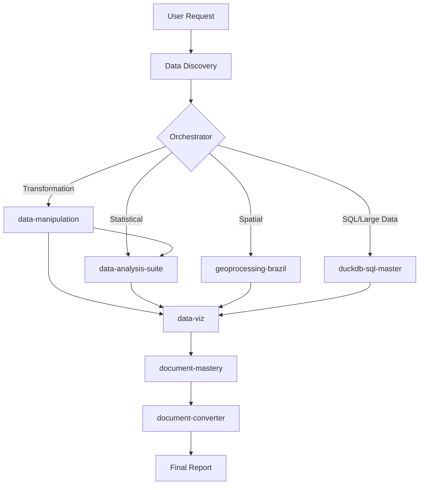

# Data Pro Max - Data Analysis Intelligence

An AI orchestrator that provides **intelligent recommendations** for data analysis, visualization, and reporting. It automatically activates for data-intensive tasks and coordinates specialized sub-skills.

## 1. Integrated Skill Cores

Data Pro Max coordinates these specialized skills: 

| Core Skill | Functionality | Location |
| :--- | :--- | :--- |
| **`data-manipulation`** | T-Layer (Preparation, Weights, Map) | 📦 `data/skills/` |
| **`data-analysis-suite`** | All Stats, Causal & Science | 📦 `data/skills/` |
| **`geoprocessing-brazil`** | Geo-spatial & Mapping | 📦 `data/skills/` |
| **`data-viz`** | Statistical Visualization | 📦 `data/skills/` |
| **`document-converter`** | Format Conversion (Import/Export) | 📦 `data/skills/` |
| **`duckdb-sql-master`** | High-performance SQL on local files | 📦 `data/skills/` |
| **`time-series-analysis`**| Validation & metrics for sequence data | 📦 `data/skills/` |
| **`clustering-toolkit`** | Advanced PCA+DBSCAN grouping | 📦 `data/skills/` |
| **`context-optimizer`** | Document decomposition into .agent | 📦 `data/skills/` |

### Shared Skills (deployed via manifest)

| Skill | Purpose | Location |
| :--- | :--- | :--- |
| **`brainstorming`** | Creative ideation & design | 🔗 `.agent/skills/` → manifest |
| **`document-mastery`** | Writing quality & Mermaid diagrams | 🔗 `.agent/skills/` → manifest |

### Agent-Only Skills (NOT deployed)

| Skill | Purpose | Location |
| :--- | :--- | :--- |
| **`skill-creator`** | Creating and packaging new skills | 🏠 `.agent/skills/` |
| **`notebooklm`** | Querying Google NotebookLM notebooks | 🏠 `.agent/skills/` |

## 2. Master Workflows (Slash Commands)

| Command | Workflow | Location |
| :--- | :--- | :--- |
| **`/project-onboarding`** | Initial setup & rules | 📦 Packaged (`datapro setup`) |
| **`/survey-analysis-pipeline`**| End-to-end execution | 📦 Packaged (`datapro setup`) |
| **`/project-harvest`** | Learning extraction → `assets/harvest/` | 📦 Packaged (`datapro setup`) |
| **`/document-study`** | Deep analysis of papers/methodology | 📦 Packaged (`datapro setup`) |
| **`/project-evolution`** | Absorb harvest into Data-Pro-Skill | 🏠 Local (this repo only) |

## 3. High-Performance Workflow

## 4. Operational Best Practices

### Step 1: Integrated Pipeline
Use **`@data-manipulation`** for preparation (mapping, cleaning, weighting) and **`@data-analysis-suite`** for specialized statistics. Consult the `references/*.md` inside each skill for specific methodologies.

### Step 2: Consistent Aesthetics
Always use `data-viz` for chart generation to ensure consistent styling and 300 DPI quality.

### Step 3: Global Language Policy
All technical artifacts, code comments, and documentation produced MUST be written in **English**.

---
> [!IMPORTANT]
> This repository uses a **References Pattern** for complex skills. If a task requires specialized stats, read the corresponding file in `data-analysis-suite/references/` first.
