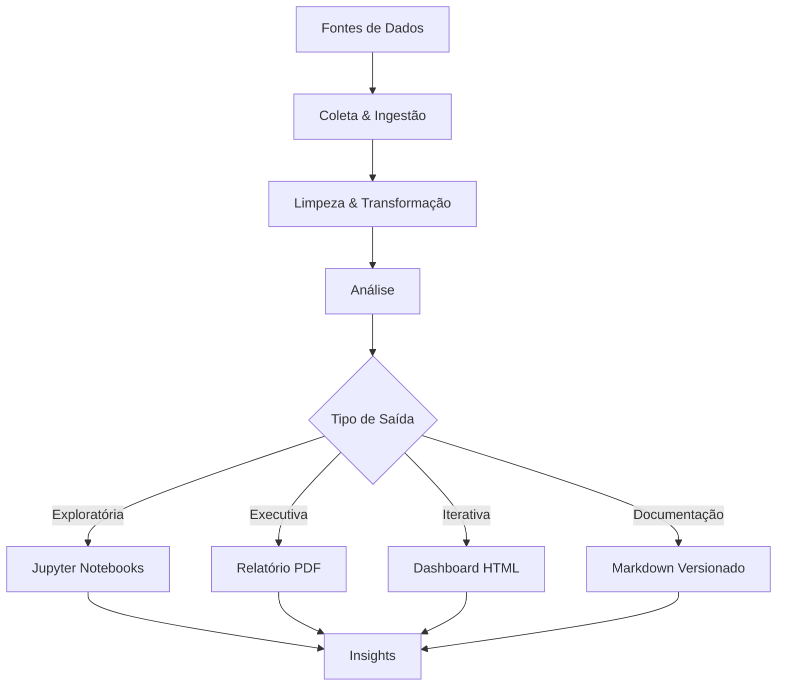

# Data Analysis & Reporting Framework

## Projeto Completo: Sistema de Análise Quantitativa e Qualitativa com Python

**Versão:** 1.0  
**Autor:** [Your Name]  
**Data:** Janeiro 2026  
**Objetivo:** Guia minucioso para construir um framework de análise de dados com Python, gerando relatórios profissionais em Markdown/PDF enriquecidos com visualizações avançadas.

---

## 📋 Índice

1. [Visão Geral do Projeto](#visão-geral)
2. [Arquitetura & Stack Tecnológico](#arquitetura)
3. [Estrutura de Diretórios](#estrutura)
4. [Componentes Principais](#componentes)
5. [Guia de Implementação](#implementação)
6. [Exemplos de Uso](#exemplos)
7. [Deployment & Distribuição](#deployment)

---

## 🎯 Visão Geral do Projeto {#visão-geral}

### Objetivo Principal

Criar um **framework end-to-end** que:

- **Coleta** dados quantitativos (estruturados) e qualitativos (não-estruturados)
- **Processa** e limpa dados usando pandas, numpy, scikit-learn
- **Analisa** padrões, correlações, estatísticas descritivas e inferenciais
- **Visualiza** insights através de múltiplos formatos:
  - 📊 Gráficos estáticos (Matplotlib, Seaborn)
  - 📈 Gráficos interativos (Plotly)
  - 🔗 Diagramas (Mermaid.js, networkx)
  - 📋 Tabelas profissionais (LaTeX, HTML)
- **Gera** relatórios profissionais em:
  - Markdown (versionável, Git-friendly)
  - PDF (compartilhável, print-ready)
  - HTML interativo (web-ready)

### Casos de Uso



---

## 🏗️ Arquitetura & Stack Tecnológico {#arquitetura}

### Stack Principal

```
┌─────────────────────────────────────────────────────────────┐
│                    CAMADA DE APRESENTAÇÃO                   │
│  ┌──────────────┬──────────────┬──────────────┬────────────┐ │
│  │ PDF Report   │ HTML Report  │ Markdown     │ Jupyter    │ │
│  │ (Quarto)     │ (Quarto)     │ (Raw)        │ Notebook   │ │
│  └──────────────┴──────────────┴──────────────┴────────────┘ │
├─────────────────────────────────────────────────────────────┤
│               CAMADA DE VISUALIZAÇÃO                         │
│  ┌──────────────┬──────────────┬──────────────┬────────────┐ │
│  │ Matplotlib   │ Seaborn      │ Plotly       │ Mermaid    │ │
│  │ (Estático)   │ (EDA)        │ (Interativo) │ (Diagramas)│ │
│  │ Pillow (IMG) │ NetworkX     │ Dash         │ Graphviz   │ │
│  └──────────────┴──────────────┴──────────────┴────────────┘ │
├─────────────────────────────────────────────────────────────┤
│                  CAMADA DE ANÁLISE                           │
│  ┌──────────────┬──────────────┬──────────────┬────────────┐ │
│  │ Pandas       │ NumPy        │ SciPy        │ Scikit-Learn│
│  │ (DataFrames) │ (Arrays)     │ (Stats)      │ (ML)       │
│  │ Polars       │ Statistics   │ Statsmodels  │ Scikit-Pos │
│  └──────────────┴──────────────┴──────────────┴────────────┘ │
├─────────────────────────────────────────────────────────────┤
│                  CAMADA DE DADOS                             │
│  ┌──────────────┬──────────────┬──────────────┬────────────┐ │
│  │ CSV/JSON     │ SQL DB       │ APIs         │ Excel      │
│  │ Parquet      │ MongoDB      │ BigQuery     │ NoSQL      │
│  └──────────────┴──────────────┴──────────────┴────────────┘ │
└─────────────────────────────────────────────────────────────┘
```

### Dependências Principais

#### Análise de Dados
```
pandas>=2.0.0          # DataFrames, manipulação de dados
numpy>=1.24.0          # Computação numérica
polars>=0.19.0         # Alternative mais rápido para grandes datasets
scipy>=1.10.0          # Funções científicas
scikit-learn>=1.3.0    # Machine Learning, preprocessing
statsmodels>=0.14.0    # Análise estatística avançada
```

#### Visualização Estática
```
matplotlib>=3.7.0      # Gráficos base
seaborn>=0.12.0        # Gráficos estatísticos
pillow>=9.5.0          # Manipulação de imagens
graphviz>=0.20.0       # Diagramas estruturados
```

#### Visualização Interativa
```
plotly>=5.14.0         # Gráficos interativos
dash>=2.14.0           # Dashboards web
kaleido>=0.2.1         # Export de gráficos Plotly para PDF/PNG
```

#### Relatórios & Markdown
```
quarto>=1.3.0          # Sistema profissional de relatórios (R Markdown para Python)
jinja2>=3.1.0          # Templates dinâmicos
markdown>=3.4.0        # Processamento Markdown
python-markdown-math>=0.8  # Suporte LaTeX em Markdown
```

#### Diagramas & Grafos
```
mermaid-py>=0.1.0      # Interface Python para Mermaid.js
networkx>=3.1.0        # Grafos e redes
```

#### Utilitários
```
python-dotenv>=1.0.0   # Variáveis de ambiente
pydantic>=2.0.0        # Validação de dados
tqdm>=4.65.0           # Progress bars
loguru>=0.7.0          # Logging profissional
pytest>=7.4.0          # Testes
```

---

## 📁 Estrutura de Diretórios {#estrutura}

```
data-analysis-platform/
│
├── 📄 README.md                          # Documentação principal
├── 📄 requirements.txt                   # Dependências do projeto
├── 📄 pyproject.toml                     # Configuração Poetry/setuptools
├── 📄 .gitignore
├── 📄 .env.example
│
├── src/                                  # Código principal
│   ├── __init__.py
│   │
│   ├── config/
│   │   ├── __init__.py
│   │   ├── settings.py                  # Configurações globais
│   │   ├── constants.py                 # Constantes
│   │   └── logger.py                    # Setup de logging
│   │
│   ├── data/
│   │   ├── __init__.py
│   │   ├── loaders.py                   # Funções de carregamento
│   │   ├── cleaners.py                  # Limpeza de dados
│   │   ├── transformers.py              # Transformações
│   │   └── validators.py                # Validação de dados
│   │
│   ├── analysis/
│   │   ├── __init__.py
│   │   ├── descriptive.py               # Estatísticas descritivas
│   │   ├── inferential.py               # Testes estatísticos
│   │   ├── correlation.py               # Análise de correlação
│   │   ├── clustering.py                # Análise de clusters
│   │   ├── sentiment.py                 # Análise de sentimentos (NLP)
│   │   └── timeseries.py                # Análise de séries temporais
│   │
│   ├── visualization/
│   │   ├── __init__.py
│   │   ├── static_plots.py              # Matplotlib/Seaborn
│   │   ├── interactive_plots.py         # Plotly
│   │   ├── mermaid_diagrams.py          # Diagramas Mermaid
│   │   ├── network_graphs.py            # NetworkX visualizations
│   │   ├── styles.py                    # Temas e estilos
│   │   └── palettes.py                  # Paletas de cores
│   │
│   ├── reporting/
│   │   ├── __init__.py
│   │   ├── template_engine.py           # Jinja2 templates
│   │   ├── markdown_builder.py          # Construtor de Markdown
│   │   ├── report_generator.py          # Orquestração de relatórios
│   │   ├── exporters.py                 # Exportação (PDF, HTML)
│   │   └── templates/
│   │       ├── base_report.md           # Template base
│   │       ├── executive_summary.md     # Resumo executivo
│   │       ├── detailed_analysis.md     # Análise detalhada
│   │       └── appendix.md              # Apêndices
│   │
│   └── utils/
│       ├── __init__.py
│       ├── file_handlers.py             # Manipulação de arquivos
│       ├── date_utils.py                # Utilitários de datas
│       └── text_utils.py                # Processamento de texto
│
├── data/                                 # Dados
│   ├── raw/                             # Dados brutos
│   ├── processed/                       # Dados processados
│   └── sample/                          # Dados de exemplo
│
├── output/                              # Saídas geradas
│   ├── reports/                         # Relatórios PDF/HTML
│   ├── visualizations/                  # Imagens individuais
│   ├── markdown/                        # Arquivos Markdown
│   └── data/                            # Dados exportados
│
├── notebooks/                           # Jupyter Notebooks
│   ├── 01_data_exploration.ipynb
│   ├── 02_data_cleaning.ipynb
│   ├── 03_statistical_analysis.ipynb
│   ├── 04_visualization_tests.ipynb
│   └── 05_report_generation.ipynb
│
├── tests/                               # Testes unitários
│   ├── __init__.py
│   ├── test_data_loaders.py
│   ├── test_analysis.py
│   └── test_visualization.py
│
├── scripts/                             # Scripts executáveis
│   ├── run_full_analysis.py             # Pipeline completo
│   ├── generate_sample_report.py        # Relatório de exemplo
│   └── setup_environment.py             # Setup inicial
│
├── docs/                                # Documentação
│   ├── installation.md
│   ├── usage_guide.md
│   ├── api_reference.md
│   └── examples.md
│
└── CI-CD/
    ├── .github/workflows/               # GitHub Actions
    │   ├── tests.yml
    │   └── build_reports.yml
    └── docker/
        ├── Dockerfile
        └── docker-compose.yml
```

---

## 🔧 Componentes Principais {#componentes}

### 1. **Data Loading & Ingestion**

```python
# src/data/loaders.py
from typing import Union, Dict, List
import pandas as pd
import polars as pl
from pathlib import Path

class DataLoader:
    """Carrega dados de múltiplas fontes com validação."""
    
    @staticmethod
    def load_csv(filepath: str, **kwargs) -> pd.DataFrame:
        """Carrega CSV com tratamento de erros."""
        return pd.read_csv(filepath, **kwargs)
    
    @staticmethod
    def load_parquet(filepath: str) -> pd.DataFrame:
        """Carrega Parquet (mais eficiente para grandes volumes)."""
        return pd.read_parquet(filepath)
    
    @staticmethod
    def load_json(filepath: str) -> Dict:
        """Carrega JSON estruturado."""
        return pd.read_json(filepath).to_dict()
    
    @staticmethod
    def load_sql(query: str, connection_string: str) -> pd.DataFrame:
        """Carrega de banco de dados SQL."""
        from sqlalchemy import create_engine
        engine = create_engine(connection_string)
        return pd.read_sql(query, engine)
    
    @staticmethod
    def load_excel(filepath: str, sheet_name: Union[str, int] = 0) -> pd.DataFrame:
        """Carrega Excel com suporte a múltiplas abas."""
        return pd.read_excel(filepath, sheet_name=sheet_name)
```

### 2. **Data Cleaning & Transformation**

```python
# src/data/cleaners.py
import pandas as pd
import numpy as np
from typing import Callable

class DataCleaner:
    """Limpeza e transformação de dados."""
    
    @staticmethod
    def handle_missing_values(df: pd.DataFrame, strategy: str = 'mean') -> pd.DataFrame:
        """
        Estratégias: 'mean', 'median', 'mode', 'forward_fill', 'drop'
        """
        if strategy == 'drop':
            return df.dropna()
        elif strategy == 'mean':
            numeric_cols = df.select_dtypes(include=[np.number]).columns
            return df.fillna(df[numeric_cols].mean())
        elif strategy == 'forward_fill':
            return df.fillna(method='ffill')
        return df
    
    @staticmethod
    def remove_duplicates(df: pd.DataFrame, subset: List = None) -> pd.DataFrame:
        """Remove duplicatas."""
        return df.drop_duplicates(subset=subset)
    
    @staticmethod
    def outlier_detection(df: pd.DataFrame, method: str = 'iqr', columns: List = None) -> pd.DataFrame:
        """
        Detecta e marca outliers.
        Métodos: 'iqr' (Interquartile Range), 'zscore'
        """
        numeric_cols = columns or df.select_dtypes(include=[np.number]).columns
        
        if method == 'iqr':
            for col in numeric_cols:
                Q1 = df[col].quantile(0.25)
                Q3 = df[col].quantile(0.75)
                IQR = Q3 - Q1
                mask = (df[col] < (Q1 - 1.5 * IQR)) | (df[col] > (Q3 + 1.5 * IQR))
                df[f'{col}_outlier'] = mask
        
        return df
    
    @staticmethod
    def normalize_text(df: pd.DataFrame, columns: List) -> pd.DataFrame:
        """Normaliza texto: minúsculas, remove pontuação."""
        import string
        for col in columns:
            df[col] = df[col].str.lower().str.translate(str.maketrans('', '', string.punctuation))
        return df
```

### 3. **Statistical Analysis**

```python
# src/analysis/descriptive.py
import pandas as pd
import numpy as np
from scipy import stats

class DescriptiveAnalysis:
    """Estatísticas descritivas e sumárias."""
    
    @staticmethod
    def summary_statistics(df: pd.DataFrame) -> pd.DataFrame:
        """Retorna estatísticas descritivas completas."""
        return df.describe(include='all').T
    
    @staticmethod
    def correlation_matrix(df: pd.DataFrame, method: str = 'pearson') -> pd.DataFrame:
        """
        Matriz de correlação.
        Métodos: 'pearson', 'spearman', 'kendall'
        """
        return df.corr(method=method)
    
    @staticmethod
    def distribution_tests(series: pd.Series) -> Dict:
        """Testes de normalidade (Shapiro-Wilk, Kolmogorov-Smirnov)."""
        shapiro_stat, shapiro_p = stats.shapiro(series.dropna())
        ks_stat, ks_p = stats.kstest(series.dropna(), 'norm')
        
        return {
            'shapiro_wilk': {'statistic': shapiro_stat, 'p_value': shapiro_p},
            'kolmogorov_smirnov': {'statistic': ks_stat, 'p_value': ks_p}
        }
    
    @staticmethod
    def group_analysis(df: pd.DataFrame, group_col: str, agg_cols: List = None) -> pd.DataFrame:
        """Análise por grupos."""
        if agg_cols is None:
            agg_cols = df.select_dtypes(include=[np.number]).columns
        
        return df.groupby(group_col)[agg_cols].agg(['count', 'mean', 'std', 'min', 'max'])
```

### 4. **Visualization Module**

```python
# src/visualization/static_plots.py
import matplotlib.pyplot as plt
import seaborn as sns
import pandas as pd
from typing import Optional, List
import numpy as np

class StaticPlots:
    """Gráficos estáticos com Matplotlib/Seaborn."""
    
    def __init__(self, style: str = 'darkgrid', palette: str = 'husl'):
        sns.set_style(style)
        sns.set_palette(palette)
        self.fig_size = (12, 6)
    
    def distribution_plot(self, data: pd.Series, title: str, bins: int = 30) -> plt.Figure:
        """Histograma + KDE."""
        fig, ax = plt.subplots(figsize=self.fig_size)
        sns.histplot(data=data, kde=True, bins=bins, ax=ax)
        ax.set_title(title, fontsize=14, fontweight='bold')
        return fig
    
    def correlation_heatmap(self, df: pd.DataFrame, title: str = "Correlation Matrix") -> plt.Figure:
        """Mapa de calor de correlações."""
        fig, ax = plt.subplots(figsize=(10, 8))
        corr_matrix = df.corr(numeric_only=True)
        sns.heatmap(corr_matrix, annot=True, fmt='.2f', cmap='coolwarm', 
                    center=0, square=True, ax=ax, cbar_kws={'label': 'Correlation'})
        ax.set_title(title, fontsize=14, fontweight='bold')
        return fig
    
    def time_series_plot(self, df: pd.DataFrame, x: str, y: str, title: str) -> plt.Figure:
        """Gráfico de série temporal."""
        fig, ax = plt.subplots(figsize=self.fig_size)
        ax.plot(df[x], df[y], linewidth=2)
        ax.fill_between(df[x], df[y], alpha=0.3)
        ax.set_title(title, fontsize=14, fontweight='bold')
        ax.set_xlabel(x)
        ax.set_ylabel(y)
        return fig
    
    def box_plot(self, df: pd.DataFrame, x: str, y: str, title: str) -> plt.Figure:
        """Box plot para distribuição por categoria."""
        fig, ax = plt.subplots(figsize=self.fig_size)
        sns.boxplot(data=df, x=x, y=y, ax=ax)
        ax.set_title(title, fontsize=14, fontweight='bold')
        return fig
    
    def scatter_plot(self, df: pd.DataFrame, x: str, y: str, 
                    hue: Optional[str] = None, title: str = "Scatter Plot") -> plt.Figure:
        """Gráfico de dispersão com hue opcional."""
        fig, ax = plt.subplots(figsize=self.fig_size)
        sns.scatterplot(data=df, x=x, y=y, hue=hue, ax=ax, s=100, alpha=0.6)
        ax.set_title(title, fontsize=14, fontweight='bold')
        return fig
    
    def save_figure(self, fig: plt.Figure, filepath: str, dpi: int = 300):
        """Salva figura em alta resolução."""
        fig.tight_layout()
        fig.savefig(filepath, dpi=dpi, bbox_inches='tight')
        plt.close(fig)
```

### 5. **Mermaid Diagrams**

```python
# src/visualization/mermaid_diagrams.py
from typing import List, Dict
import json

class MermaidDiagrams:
    """Geração programática de diagramas Mermaid."""
    
    @staticmethod
    def flowchart(nodes: List[Dict], edges: List[tuple], title: str = "") -> str:
        """
        Cria flowchart.
        nodes: [{"id": "A", "label": "Start"}, ...]
        edges: [("A", "B"), ("B", "C"), ...]
        """
        diagram = "```mermaid\n"
        if title:
            diagram += f"---\ntitle: {title}\n---\n"
        diagram += "flowchart TD\n"
        
        for node in nodes:
            diagram += f"    {node['id']}[\"{node['label']}\"]\n"
        
        for src, dst in edges:
            diagram += f"    {src} --> {dst}\n"
        
        diagram += "```"
        return diagram
    
    @staticmethod
    def sequence_diagram(actors: List[str], interactions: List[tuple], 
                        title: str = "") -> str:
        """
        Diagrama de sequência.
        interactions: [("Alice", "Bob", "Hello"), ...]
        """
        diagram = "```mermaid\n"
        if title:
            diagram += f"---\ntitle: {title}\n---\n"
        diagram += "sequenceDiagram\n"
        
        for actor in actors:
            diagram += f"    participant {actor}\n"
        
        for src, dst, msg in interactions:
            diagram += f"    {src}->>+{dst}: {msg}\n"
            diagram += f"    {dst}-->>-{src}: OK\n"
        
        diagram += "```"
        return diagram
    
    @staticmethod
    def gantt_chart(tasks: List[Dict], title: str = "") -> str:
        """
        Diagrama de Gantt.
        tasks: [{"name": "Task 1", "start": "2024-01-01", "duration": "10d"}, ...]
        """
        diagram = "```mermaid\n"
        if title:
            diagram += f"---\ntitle: {title}\n---\n"
        diagram += "gantt\n"
        diagram += "    title Project Timeline\n"
        
        for task in tasks:
            diagram += f"    {task['name']} :s1, {task['start']}, {task['duration']}\n"
        
        diagram += "```"
        return diagram
    
    @staticmethod
    def entity_relationship(entities: Dict[str, List[str]], 
                           relationships: List[tuple]) -> str:
        """
        Diagrama ER.
        entities: {"User": ["id", "name", "email"], ...}
        relationships: [("User", "Post", "1:N"), ...]
        """
        diagram = "```mermaid\n"
        diagram += "erDiagram\n"
        
        for entity, attrs in entities.items():
            diagram += f"    {entity} {{\n"
            for attr in attrs:
                diagram += f"        string {attr}\n"
            diagram += "    }\n"
        
        for src, dst, rel in relationships:
            diagram += f"    {src} ||--o{{ {dst} : \"{rel}\"\n"
        
        diagram += "```"
        return diagram
    
    @staticmethod
    def graph_diagram(nodes: Dict[str, str], edges: List[tuple]) -> str:
        """Grafo genérico."""
        diagram = "```mermaid\n"
        diagram += "graph TD\n"
        
        for node_id, label in nodes.items():
            diagram += f"    {node_id}[\"{label}\"]\n"
        
        for src, dst in edges:
            diagram += f"    {src} --> {dst}\n"
        
        diagram += "```"
        return diagram
```

### 6. **Report Generation Engine**

```python
# src/reporting/report_generator.py
from pathlib import Path
from datetime import datetime
import json
from typing import Dict, Any, List

class ReportGenerator:
    """Orquestra a geração completa de relatórios."""
    
    def __init__(self, output_dir: str = "output/reports"):
        self.output_dir = Path(output_dir)
        self.output_dir.mkdir(parents=True, exist_ok=True)
        self.report_content = []
        self.metadata = {
            'generated_at': datetime.now().isoformat(),
            'title': '',
            'author': '',
            'sections': []
        }
    
    def add_title(self, title: str, subtitle: str = ""):
        """Adiciona título ao relatório."""
        self.metadata['title'] = title
        markdown = f"# {title}\n"
        if subtitle:
            markdown += f"**{subtitle}**\n"
        markdown += f"\n_Gerado em: {datetime.now().strftime('%d/%m/%Y %H:%M:%S')}_\n\n"
        self.report_content.append(markdown)
    
    def add_section(self, section_name: str, level: int = 2):
        """Adiciona nova seção."""
        self.metadata['sections'].append(section_name)
        markdown = f"{'#' * level} {section_name}\n\n"
        self.report_content.append(markdown)
    
    def add_text(self, text: str):
        """Adiciona parágrafo de texto."""
        self.report_content.append(f"{text}\n\n")
    
    def add_table(self, df: pd.DataFrame, title: str = ""):
        """Adiciona tabela formatada."""
        if title:
            self.report_content.append(f"**{title}**\n\n")
        self.report_content.append(df.to_markdown(index=False))
        self.report_content.append("\n\n")
    
    def add_figure(self, image_path: str, caption: str = "", width: str = "100%"):
        """Adiciona figura com caption."""
        markdown = f"\n"
        if caption:
            markdown += f"*{caption}*\n"
        markdown += "\n"
        self.report_content.append(markdown)
    
    def add_code_block(self, code: str, language: str = "python"):
        """Adiciona bloco de código."""
        markdown = f"```{language}\n{code}\n```\n\n"
        self.report_content.append(markdown)
    
    def add_mermaid_diagram(self, mermaid_code: str):
        """Adiciona diagrama Mermaid."""
        self.report_content.append(mermaid_code)
        self.report_content.append("\n\n")
    
    def add_statistics_summary(self, stats_dict: Dict[str, Any]):
        """Adiciona resumo estatístico em formato visual."""
        markdown = "| Métrica | Valor |\n"
        markdown += "|---------|-------|\n"
        for key, value in stats_dict.items():
            if isinstance(value, float):
                markdown += f"| {key} | {value:.2f} |\n"
            else:
                markdown += f"| {key} | {value} |\n"
        self.report_content.append(markdown)
        self.report_content.append("\n\n")
    
    def generate_markdown(self) -> str:
        """Retorna relatório em Markdown."""
        return "".join(self.report_content)
    
    def save_markdown(self, filename: str = "report.md") -> Path:
        """Salva relatório em Markdown."""
        filepath = self.output_dir / filename
        with open(filepath, 'w', encoding='utf-8') as f:
            f.write(self.generate_markdown())
        return filepath
    
    def save_pdf(self, filename: str = "report.pdf") -> Path:
        """
        Converte Markdown para PDF usando Quarto.
        Requer: pip install quarto
        """
        import subprocess
        
        md_path = self.save_markdown(filename.replace('.pdf', '.md'))
        pdf_path = self.output_dir / filename
        
        cmd = f"quarto render {md_path} --to pdf --output {pdf_path}"
        subprocess.run(cmd, shell=True, check=True)
        
        return pdf_path
    
    def save_html(self, filename: str = "report.html") -> Path:
        """Salva relatório em HTML interativo."""
        import subprocess
        
        md_path = self.save_markdown(filename.replace('.html', '.md'))
        html_path = self.output_dir / filename
        
        cmd = f"quarto render {md_path} --to html --output {html_path}"
        subprocess.run(cmd, shell=True, check=True)
        
        return html_path
```

---

## 📚 Guia de Implementação {#implementação}

### Passo 1: Setup Inicial

```bash
# Clone ou crie novo projeto
git init data-analysis-platform
cd data-analysis-platform

# Create virtual environment
python -m venv venv
source venv/bin/activate  # Windows: venv\Scripts\activate

# Install dependencies
pip install -r requirements.txt

# Install Quarto (para relatórios profissionais)
# macOS:
brew install quarto

# Linux:
wget https://github.com/quarto-dev/quarto-cli/releases/download/v1.3.0/quarto-1.3.0-linux-amd64.deb
sudo dpkg -i quarto-1.3.0-linux-amd64.deb
```

### Passo 2: Estruture seus Dados

```python
# scripts/load_and_explore.py
from src.data.loaders import DataLoader
from src.data.cleaners import DataCleaner
import pandas as pd

# Carregue dados
df = DataLoader.load_csv('data/raw/dataset.csv')

# Explore
print(df.head())
print(df.info())
print(df.describe())

# Limpe
df = DataCleaner.handle_missing_values(df, strategy='mean')
df = DataCleaner.remove_duplicates(df)
df = DataCleaner.outlier_detection(df, method='iqr')

# Salve processado
df.to_parquet('data/processed/dataset_clean.parquet')
```

### Passo 3: Análise Exploratória

```python
# notebooks/01_data_exploration.ipynb
import pandas as pd
import numpy as np
from src.analysis.descriptive import DescriptiveAnalysis
from src.visualization.static_plots import StaticPlots

# Load data
df = pd.read_parquet('data/processed/dataset_clean.parquet')

# Descriptive stats
stats = DescriptiveAnalysis.summary_statistics(df)
print(stats)

# Correlations
corr = DescriptiveAnalysis.correlation_matrix(df)

# Visualizations
plotter = StaticPlots(style='whitegrid')
fig = plotter.correlation_heatmap(df)
plotter.save_figure(fig, 'output/visualizations/correlation_matrix.png')
```

### Passo 4: Gere Visualizações Profissionais

```python
# scripts/generate_visualizations.py
from src.visualization.static_plots import StaticPlots
from src.visualization.mermaid_diagrams import MermaidDiagrams
import pandas as pd

df = pd.read_parquet('data/processed/dataset_clean.parquet')

# Matplotlib/Seaborn
plotter = StaticPlots()
figs = {
    'distribution': plotter.distribution_plot(df['column'], 'Distribution'),
    'correlation': plotter.correlation_heatmap(df),
    'scatter': plotter.scatter_plot(df, 'x', 'y', hue='category')
}

for name, fig in figs.items():
    plotter.save_figure(fig, f'output/visualizations/{name}.png')

# Mermaid Diagrams
workflow = MermaidDiagrams.flowchart(
    nodes=[
        {"id": "A", "label": "Data Ingestion"},
        {"id": "B", "label": "Cleaning"},
        {"id": "C", "label": "Analysis"},
        {"id": "D", "label": "Visualization"},
        {"id": "E", "label": "Report"}
    ],
    edges=[("A", "B"), ("B", "C"), ("C", "D"), ("D", "E")],
    title="Analysis Pipeline"
)
print(workflow)
```

### Passo 5: Crie Relatório Completo

```python
# scripts/generate_full_report.py
from src.reporting.report_generator import ReportGenerator
from src.analysis.descriptive import DescriptiveAnalysis
import pandas as pd

# Initialize report
report = ReportGenerator(output_dir='output/reports')

# Add content
report.add_title("Análise Completa de Dados", "Relatório Executivo - Janeiro 2026")

report.add_section("1. Introdução")
report.add_text("Este relatório apresenta análises quantitativas e qualitativas...")

report.add_section("2. Estatísticas Descritivas")
df = pd.read_parquet('data/processed/dataset_clean.parquet')
stats = DescriptiveAnalysis.summary_statistics(df)
report.add_table(stats)

report.add_section("3. Visualizações")
report.add_figure('output/visualizations/correlation_matrix.png', 
                 'Matriz de Correlação')
report.add_figure('output/visualizations/distribution.png',
                 'Distribuição de Dados')

report.add_section("4. Conclusões")
report.add_text("As análises revelam...")

# Export
report.save_markdown('analise_2026.md')
report.save_pdf('analise_2026.pdf')
report.save_html('analise_2026.html')

print("✅ Relatório gerado em output/reports/")
```

---

## 📊 Exemplos de Uso {#exemplos}

### Exemplo 1: Análise de Vendas

```python
# Carrega dados
df_vendas = pd.read_csv('data/vendas_2025.csv')

# Análise por região
analise_regiao = DescriptiveAnalysis.group_analysis(
    df_vendas, 
    group_col='regiao',
    agg_cols=['vendas', 'lucro']
)

# Visualiza
fig = StaticPlots().scatter_plot(
    df_vendas, 
    x='custos', 
    y='vendas',
    hue='regiao',
    title='Vendas vs Custos por Região'
)
```

### Exemplo 2: Análise de Sentimentos (NLP)

```python
# Análise qualitativa
from src.analysis.sentiment import SentimentAnalysis

df_reviews = pd.read_csv('data/reviews.csv')

# Processa sentimentos
sa = SentimentAnalysis()
df_reviews['sentiment'] = df_reviews['texto'].apply(sa.analyze)
df_reviews['sentiment_score'] = df_reviews['texto'].apply(sa.score)

# Visualiza distribuição
report.add_figure('sentiment_distribution.png')
```

### Exemplo 3: Network Analysis

```python
import networkx as nx
import matplotlib.pyplot as plt

# Cria grafo de relacionamentos
G = nx.Graph()
edges = [('User A', 'User B'), ('User B', 'User C'), ...]
G.add_edges_from(edges)

# Visualiza
pos = nx.spring_layout(G)
plt.figure(figsize=(12, 8))
nx.draw_networkx_nodes(G, pos, node_color='skyblue', node_size=500)
nx.draw_networkx_labels(G, pos)
nx.draw_networkx_edges(G, pos, width=2)
plt.title("Network of Relationships")
plt.axis('off')
plt.savefig('output/network.png', dpi=300, bbox_inches='tight')
```

---

## 🚀 Deployment & Distribuição {#deployment}

### Relatório Estático (PDF Share)
```bash
# Gera PDF final
python scripts/generate_full_report.py
# Envia por email: output/reports/analise_2026.pdf
```

### Relatório Interativo (Web)
```bash
# Hospeda em Quarto Connect
quarto publish connect output/reports/analise_2026.html
```

### Automação (CI/CD)
```yaml
# .github/workflows/build_reports.yml
name: Generate Reports
on:
  schedule:
    - cron: '0 0 * * 0'  # Weekly
jobs:
  build:
    runs-on: ubuntu-latest
    steps:
      - uses: actions/checkout@v2
      - uses: actions/setup-python@v2
      - run: pip install -r requirements.txt
      - run: python scripts/generate_full_report.py
      - uses: actions/upload-artifact@v2
```

### Docker
```dockerfile
FROM python:3.11-slim

WORKDIR /app
COPY requirements.txt .
RUN pip install -r requirements.txt && apt-get install -y quarto

COPY . .
CMD ["python", "scripts/generate_full_report.py"]
```

---

## 📈 Próximos Passos

1. ✅ Instale todas as dependências
2. ✅ Configure estrutura de diretórios
3. ✅ Prepare dados amostrais
4. ✅ Implemente módulos de análise
5. ✅ Crie templates de relatórios
6. ✅ Automatize geração de reports
7. ✅ Implante em produção

**Tempo estimado:** 2-4 semanas (desenvolvimento completo)

---

## 📚 Referências

- [Quarto Official Docs](https://quarto.org)
- [Pandas Documentation](https://pandas.pydata.org)
- [Plotly Documentation](https://plotly.com/python)
- [Seaborn Tutorial](https://seaborn.pydata.org)
- [Mermaid.js Docs](https://mermaid.js.org)
- [NetworkX Guide](https://networkx.org)

---

**Versão:** 1.0 | **Última atualização:** Janeiro 2026 | **Status:** ✅ Pronto para uso
