# /dps-cross [VarX] x [VarY] — Tufte Crosstab

Produces contingency tables with automatic statistical test via Python pipeline. Markdown output includes Mermaid bar charts for visual comparison.

## Pipeline

```
data.csv + X + Y → scripts/crosstabs.py → cross_{X}_{Y}.csv + cross_stats.json + cross_report.md
```

## Execution Steps

1. **Parse** — extract X (index) and Y (columns) from command
2. **Validate** — both columns exist, sufficient N per cell
3. **Select test** via Statistical Test Selector Matrix:
   - 2 categorical: χ² (Fisher if N<5 per cell)
   - 1 categorical + 1 continuous: t-test (Mann-Whitney U if non-normal)
   - 2 continuous: Pearson's r (Spearman's ρ)
4. **Run Python**:
   ```bash
   python3 .dps/scripts/crosstabs.py data.csv --index X --columns Y --output .dps/outputs/cross/
   ```
5. **Read** — load cross table CSV + stats JSON
6. **Render** — Tufte table + Mermaid bar chart + margin note

## Output Format

```markdown
| VarX \ VarY | Cat 1 | Cat 2 | Total | N |
|-------------|-------|-------|-------|---|
| Group A     | 45%   | 55%   | 100%  |200|
| Group B     | 30%   | 70%   | 100%  |180|

```mermaid
%% Bar chart comparing categories
xychart-beta
  title "X by Y"
  x-axis "Category" ["A","B"]
  y-axis "Percent" 0 --> 100
  bar [45, 30]
  bar [55, 70]
```



> **Margin Note:** χ²(3, N=1450)=24.7, p<0.001. Cramér's V=0.42 (moderate).
```

## Flags

- `--test chi2|ttest|anova`: override test selection
- `--mermaid`: force Mermaid chart always
