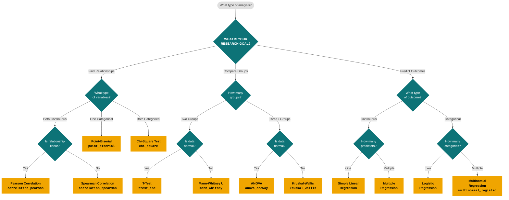

# Statistical Test Selector

A decision framework for choosing the right statistical test based on research goal, variable types, and data assumptions. Derived from Dr. Samira Hosseini's flowchart.

## Decision Tree

## Quick Reference Table

| Research Goal | Variables / Conditions | Test | Snippet ID | Parametric? |
|---|---|---|---|---|
| **Find Relationships** | Both continuous + linear | Pearson Correlation | `correlation_pearson` | Yes |
| | Both continuous + non-linear | Spearman Correlation | `correlation_spearman` | No |
| | 1 categorical + 1 continuous | Point-Biserial Correlation | `point_biserial` | Yes |
| | Both categorical | Chi-Square Test | `chi_square` | No |
| **Compare Groups** | 2 groups + normal data | Independent T-Test | `ttest_ind` | Yes |
| | 2 groups + non-normal data | Mann-Whitney U Test | `mann_whitney` | No |
| | 3+ groups + normal data | One-Way ANOVA | `anova_oneway` | Yes |
| | 3+ groups + non-normal data | Kruskal-Wallis H Test | `kruskal_wallis` | No |
| **Predict Outcomes** | 1 predictor → continuous outcome | Simple Linear Regression | — | Yes |
| | Multiple predictors → continuous outcome | Multiple Regression | — | Yes |
| | Predictors → binary outcome | Logistic Regression | — | Yes |
| | Predictors → multi-class outcome | Multinomial Regression | `multinomial_logistic` | Yes |

## Pre-Test Assumptions Checklist

Before selecting a test, verify these assumptions:

| Check | How to Test | Snippet ID |
|---|---|---|
| **Normality** | Shapiro-Wilk (n ≤ 5000) | `normality_test` |
| **Linearity** | Scatter plot or partial residual plot | `partial_residual_plot` |
| **Homoscedasticity** | Levene's test or residual plot | — |
| **Sample size** | n ≥ 30 per group (CLT) for parametric | — |
| **Independence** | Study design (no repeated measures) | — |

> [!TIP]
> When in doubt between parametric and non-parametric: if n < 30 per group or Shapiro-Wilk p < 0.05, prefer the non-parametric alternative. Non-parametric tests sacrifice only a small amount of power when assumptions are met, but are far more robust when they are not.

## Decision Heuristics

1. **Goal first**: Always start by classifying your research question into one of the three branches.
2. **Variable types second**: Count how many variables and what types (continuous, ordinal, nominal).
3. **Assumptions third**: Only after selecting a candidate test, verify its assumptions.
4. **Effect size always**: Statistical significance alone is insufficient. Always report effect sizes (Cohen's d, Cramér's V, η², R²).

> [!IMPORTANT]
> **Ordinal data** (Likert scales, rankings): Treat as non-parametric unless the scale has ≥ 7 points and the distribution is approximately symmetric. Use Spearman over Pearson, and Mann-Whitney/Kruskal-Wallis over T-Test/ANOVA.

## Source Attribution

- **Original flowchart**: Dr. Samira Hosseini — "Statistical Analysis Methods"
- **Adapted for**: Data-Pro-Skill `survey-analytics` reference library
- **Adaptation date**: 2026-02-27

---

> [!NOTE]
> Last updated: 2026-02-27
